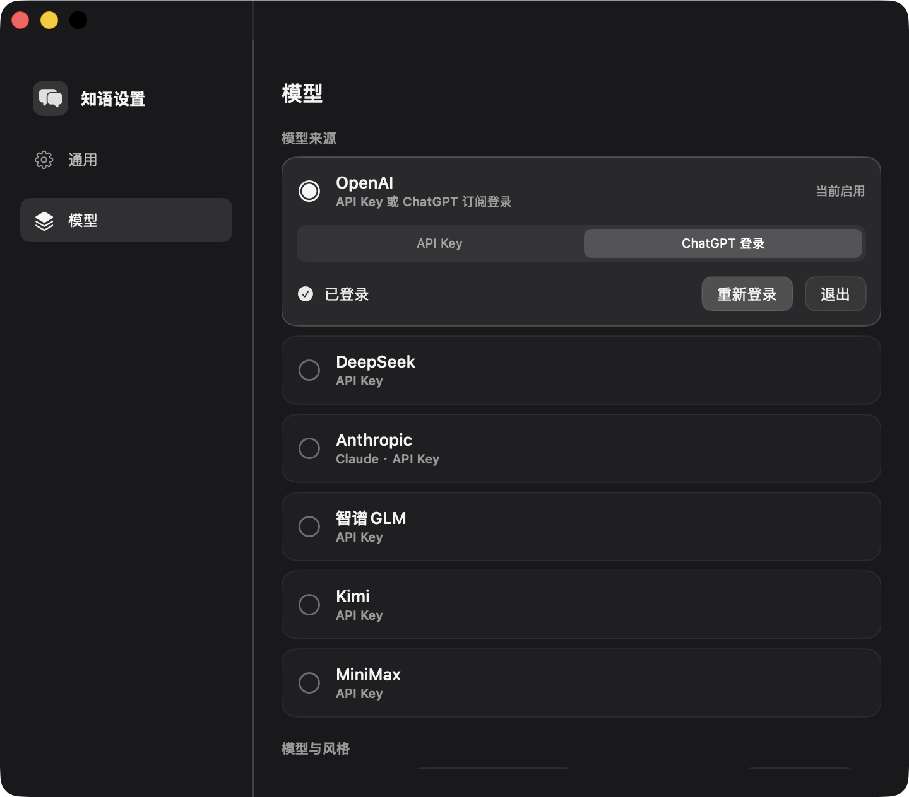

# 知语 ZhiYu

**macOS 菜单栏里的微信回复助手** —— 读懂当前会话，用大模型生成候选回复，一键填入或发送。

知语是一个常驻菜单栏的 macOS 小工具。它通过系统**辅助功能（Accessibility）**读取你**当前打开的那个微信会话**，调用你选择的大模型生成几条候选回复；你挑一条填入输入框，或直接发出。全程在本机完成，**不经过任何中间服务器**。

> ⚠️ 这是个人项目，涉及自动化操作微信，请先读下面的 [隐私与安全](#-隐私与安全) 和 [免责声明](#️-免责声明)，自行评估风险。建议先用「文件传输助手」试用。

---

## ✨ 功能

- **🎙️ 语音自动转文字**：会话里有没转文字的语音消息？知语会自动驱动微信「转文字」，等转写落地后再读进上下文生成回复——你一个字都不用手点。
- **⚡ 新消息自动候选**：对方一来消息，后台就先把候选生成好；等你切回微信前台，面板才弹出来（你正在打字时不抢输入框）。当然也能随时**双击右 ⌘** 手动唤起。
- **🎭 回复风格可调**：内置 **自然 / 简短 / 损友 / 幽默 / 正经** 五种，外加**自定义提示词**。底层统一强制「像真人、不像客服」，还会**模仿你历史里的说话腔调**，尽量别让对方看出是 AI。
- **🤖 多模型（Provider）**：**OpenAI**、**DeepSeek**，填各自的 API Key 即用。
- **👀 看得懂图片和表情包**：图片 / 表情消息自动截图，交给多模态模型识别后再结合内容回复（需屏幕录制权限）。
- **😀 会发原生表情**：模型觉得用表情更自然时给个关键词，一键用**微信自带的表情搜索**发出第一个结果。
- **🖱️ 即时悬浮面板**：双击右 ⌘ **秒弹**；面板**可拖动**到顺手的位置并**记住**；点候选填入、点纸飞机发送、数字键 `1·2·3` 选中、`Esc` 关闭、双击标题栏回到默认位置。
- **🔒 纯本机**：无服务端、无遥测；候选缓存只在内存，退出即清。

## 📸 截图

**设置** —— 选 Provider、填 API Key、选模型与回复风格

  

**候选面板** —— 双击右 ⌘ 弹出，挑一条填入或直接发

## 🚀 快速开始

**环境**
- macOS 14+
- Mac 版微信（4.x，原生 AppKit）
- 构建需 Xcode 16+

**构建运行**
1. clone 本仓库，用 Xcode 打开 `ZhiYu.xcodeproj`
2. 在 `ZhiYu` target → *Signing & Capabilities*，把 **Team / `DEVELOPMENT_TEAM` 改成你自己的**（仓库里留的是作者的，你必须换成自己的，否则签名失败）
3. `⌘R` 运行 —— 它会出现在**菜单栏**（绿底「语」字图标），没有 Dock 图标
4. 首次运行按提示**授予权限**（见下）

## 🔑 权限

知语靠系统辅助功能读写微信，必须授权：

| 权限 | 必需性 | 用途 |
|---|---|---|
| **辅助功能** | 必需 | 读消息、填入 / 发送、点转文字、发表情 |
| **屏幕录制** | 可选 | 让模型"看懂"图片 / 表情包；不授权时图片消息自动降级为纯文本 |

菜单栏里有快捷入口与状态点（🟢 已授权 / ⚪ 未授权）。

> ⚠️ **重要**：本项目**必须关闭 App Sandbox** 且用**稳定签名**（固定 Team），否则每次重新构建系统都会把辅助功能授权失效、要反复重授。这也是上面让你设自己 Team 的原因。

## 🤖 配置模型

菜单栏 →「设置」：
- 选 Provider（**OpenAI** / **DeepSeek**），填对应 **API Key**（存进 macOS **钥匙串**，不入仓库、不随项目分发）
- 选模型、选**回复风格**（自然 / 简短 / 损友 / 幽默 / 正经，或自定义提示词）

## 🕹 使用

- 在微信里把光标放进某个会话 → **双击右 Command** → 候选面板弹在输入框上方
- **点候选文本** = 只填入；**点纸飞机** = 填入并发送；**数字键 `1`/`2`/`3`** = 选中；**`Esc`** = 关闭
- **拖动面板标题栏**可把它挪到顺手的位置，之后会记住；**双击标题栏**回到默认位置
- 出现 **「😊 发表情」** 芯片时点它，会用微信表情搜索发出第一个结果
- 想更省事：设置里开「新消息自动生成候选」—— 对方来消息时后台先生成，你切回微信就直接弹（不抢你正在打字的输入框）

## 🔒 隐私与安全

- 知语在**本机**读取你**当前打开的那个会话**的内容，组成 prompt 发给**你自己选择并填了 Key 的大模型**。除此之外**不连任何服务器、无遥测、无上报**。
- 候选缓存只在**内存**，App 退出即清，**不落盘、不持久化聊天内容**。
- 你的 API Key / 登录 token 存在 macOS **钥匙串**，不写进仓库。
- 但请知悉：把聊天内容发给第三方大模型，本身就意味着这些内容**离开了你的设备**、交由该模型提供方处理。请只在你接受这一点的会话里使用。

## ⚖️ 免责声明

- 知语通过自动化（辅助功能 / 模拟输入）操作微信，这类自动化**可能不符合微信使用条款，存在账号风险**，请自行评估、**自负风险**。建议先用「文件传输助手」测试。
- 本项目仅供学习与个人使用。作者不对因使用本工具造成的任何后果（账号、数据、服务条款等）负责。

## 🧩 架构

- **`ZhiYu/`** —— macOS App：菜单栏、候选悬浮面板、AX 引擎 `WeChatAXProbe`、微信自动化（读取 / 输入 / 转文字 / 发表情）、权限、设置
- **`ZhiYuCore/`** —— 纯逻辑的 Swift Package：Provider/OAuth、prompt 组装、候选解析、缓存、节奏判定，带单元测试（`cd ZhiYuCore && swift test`）
- 纯 AX + 本机，**无服务端**

> 更细的设计与探针结论见 [`docs/`](docs/)。

## 📄 License

[MIT](LICENSE) © 2026 Wentong Liu
